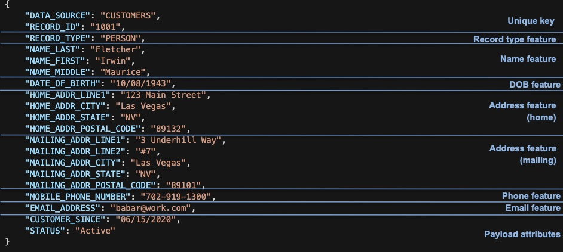

The Senzing engine performs entity resolution to determine when entities are the same or related, both within and across your data sources.

Senzing uses a simple JSON-in, JSON-out message structure. It is pre-configured with all the attributes needed to resolve persons and organizations. For example, there are attributes for names, addresses, phone numbers, identifiers such as driver’s license, passport, and email address, as well as other attributes like date of birth and gender.

This specification lists all the pre-configured attributes, along with descriptions of how and when to use them.

Your task is to map the fields from your source records to the corresponding attributes defined in this specification, and format them as a JSON message to submit to the Senzing SDK for resolution.

## Key Terms


Entities, Features and Attributes:

- **Entity** — Records of real-life persons, organizations, or things in your data sources.
- **Features** — Details that describe an entity, such as a name, phone number, or address.
- **Attributes** — Specific components of features. For instance, a name feature might include first and last name. Addresses can have multiple lines, a city, and a state. Even driver’s licenses and passports have a number and an issuing authority.

Some additional terms you will see in this specification are:

- **Labels** — The use of labels is optional. However, it's good to apply them when there is more than one of something, like:
  - a primary name and one or more AKAs
  - a home and a mailing address

Labels do not have to be registered in Senzing, but there are a select few that it recognizes. For instance, a "Mobile" phone has more weight than a "Home" phone.

- **Payload** - You can also map attributes that are not used for resolution, but add meaning for you. While you can add anything you want to a Senzing JSON record, we suggest looking for some key dates, statuses, and categories that can help you understand a match.  For instance:
  - If a duplicate customer was found, are they both active?  
  - Which customer record came first?
  - If you matched a customer to a watchlist, what put them on the watchlist?

## What Features to Look For

***Pro Tip:** The more features on each record, the better the entity resolution!*

### Desired Features For Persons
- All names: Primary, Aka, etc
- Date of birth and gender
- Passport, driver’s license, social security number, national insurance number
- Home and mailing addresses
- Home and cell phone numbers
- Email and social media handles
- Groups that they are associated with, such as their employer name
- Relationships such as:
  - Familial
  - Joint accounts, co-signers
  - Beneficial ownership
  - Principal role in a company

### Desired Features For Organizations
- All names: registered, DBA, etc
- National Registry numbers
- Tax ID numbers
- Other ID numbers assigned by agencies or data providers
- Physical and mailing addresses
- All phone numbers
- Website and social media handles
- Relationships between them such as:
  - direct and ultimate parents 
  - subsidiaries
  - branches


## Examples of Senzing JSON

Senzing JSON can either be flat like this:

```JSON
{
    "DATA_SOURCE": "CUSTOMERS",
    "RECORD_ID": "1001",
    "RECORD_TYPE": "PERSON",
    "NAME_LAST": "Fletcher",
    "NAME_FIRST": "Irwin",
    "NAME_MIDDLE": "Maurice",
    "DATE_OF_BIRTH": "10/08/1943",
    "HOME_ADDR_LINE1": "123 Main Street",
    "HOME_ADDR_CITY": "Las Vegas",
    "HOME_ADDR_STATE": "NV",
    "HOME_ADDR_POSTAL_CODE": "89132",
    "MAILING_ADDR_LINE1": "3 Underhill Way",
    "MAILING_ADDR_LINE2": "#7",
    "MAILING_ADDR_CITY": "Las Vegas",
    "MAILING_ADDR_STATE": "NV",
    "MAILING_ADDR_POSTAL_CODE": "89101",
    "MOBILE_PHONE_NUMBER": "702-919-1300",
    "EMAIL_ADDRESS": "babar@work.com",
    "CUSTOMER_SINCE": "06/15/2020",
    "STATUS": "Active"
}
```
Looking at it from top to bottom:



- DATA_SOURCE and RECORD_ID form the unique key.  
- RECORD_TYPE is highly desired and is usually PERSON or ORGANIZATION, but you can use other terms.  It serves two purposes:
  1. It keeps persons from resolving to their trusts or companies they have created using their name and address.
  2. Can be used to determine node shape in a graph.

- Next there are all the features.

  - There are three attributes for the name feature.
  - There is one attribute for the date of birth feature.
  - There are two address features.  Notice all of the attributes for each address have a label prefix?  Without it we wouldn't know which address lines went with which city, and so on.
  - There is one attribute for the phone number feature.  It is prefixed with the mobile label to give it more weight.
  - There is one attribute for the email address feature.
- Finally, there are a couple of payload attributes at the end.

Alternatively, you can place all the features in a list like this:

```JSON
{
    "DATA_SOURCE": "CUSTOMERS",
    "RECORD_ID": "1001",
    "RECORD_TYPE": "PERSON",
    "FEATURES":
    [
        {
            "NAME_LAST": "Fletcher",
            "NAME_FIRST": "Irwin",
            "NAME_MIDDLE": "Maurice"
        },
        {
            "DATE_OF_BIRTH": "10/08/1943"
        },
        {
            "ADDR_TYPE": "HOME",
            "ADDR_LINE1": "123 Main Street",
            "ADDR_CITY": "Las Vegas",
            "ADDR_STATE": "NV",
            "ADDR_POSTAL_CODE": "89132"
        },
        {
            "ADDR_TYPE": "MAILING",
            "ADDR_LINE1": "3 Underhill Way",
            "ADDR_LINE2": "#7",
            "ADDR_CITY": "Las Vegas",
            "ADDR_STATE": "NV",
            "ADDR_POSTAL_CODE": "89101"
        },
        {
            "PHONE_TYPE": "MOBILE",
            "PHONE_NUMBER": "702-919-1300"
        },
        {
            "EMAIL_ADDRESS": "babar@work.com"
        }
    ],
    "CUSTOMER_SINCE": "06/15/2020",
    "STATUS": "Active"
}
```

The real advantage to the list approach is that you don't have to be careful to use a label prefix when you have more than one attribute for a feature.  Notice in the json above that the addresses have the label in the ADDR_TYPE attribute and the phone's label is in the PHONE_TYPE attribute.  

Many developers have asked: If I have multiple phone numbers, can I just place them in a list of strings like so:

```JSON
{
    "PHONE_NUMBER":
    [
        "555-1212",
        "555-0000"
    ]
}
```

The answer to that is no, it must be a list of dictionaries, e.g. each feature's attributes are enclosed in curly braces, and ideally you label them like so:

```JSON
{
    "FEATURES":
    [
        {
            "PHONE_TYPE": "MOBILE",
            "PHONE_NUMBER": "555-1212"
        },
        {
            "PHONE_TYPE": "WORK",
            "PHONE_NUMBER": "555-0000"
        }
    ]
}
```

In prior versions of this specification, we suggested you create a list for names if needed, a list for addresses if needed, and so on. However, that created questions such as:
1. What do you name the list?
2. Can I put addresses and phones in the same list?

So to simplify, you can just create one list for all your features as shown above.  Just remember, it's a list of features that have one or more attributes.  Hence, each feature must be enclosed in curly braces.

### Types of data sources

Data sources you will be asked to map to Senzing range from the very simple to the very complex.   Here are some of the types we have run into so far and some instructions on how to map them.

- **Type 1**: A single flat table that contains one line per entity.  There is usually a unique key, and columns that contain names, addresses, phone numbers, etc.

- **Type 2**: A single flat table with multiple rows per entity.  Usually there are only one set of name fields, address fields, etc.  But if an entity has more than one address, they will have multiple rows. Sometimes there is a secondary key that can be used to find all the rows for an entity.  Sometimes you have to derive one from multiple fields. Certain watch lists are like this because they are designed for ease of searching rather than for entity resolution.

- **Type 3**: A single semi-flat table, but the columns might contain lists:  Many XML, JSON or Parquet files are like this. There will only be one row per entity, but the name field(s) may have a list of names, the address fields a list of addresses, etc.

- **Type 4**: Multiple tables or files per entity.  This is often the case when pulling entities out of a normalized database, but can also occur when you receive a dump of a database in a single JSON or XML source file.  In a case like this you must realize there is usually a master table or schema and one or more child tables or schemas, such as a list of addresses, phone numbers, identifiers, relationships, etc.   Sometimes there are even codes files such a a list of number types, a list of country codes, and so on, that must be looked up.  Since Senzing requires one message per entity, you have to join all the master and child tables together. A good approach here is to map each file and join them together for the final step. Spark is a good candidate in this case.

- **Type 5**: Transaction table with embedded entities.  Wire transfers are a good example of this as they reference external accounts with an account number, name and address that aren't well controlled.  Furthermore, there may be thousands with the exact same values.  A good approach here is to extract the identifying fields and dedupe them before sending to Senzing.  You can create a unique key by hashing the identifying fields to use as a RECORD_ID in Senzing and also stamp it on the transaction record itself so that you can join the transaction to its resolved entity and relationships in Senzing for analysis.

### Updating vs replacing records

When information about a master record changes, that record should be re-sent to Senzing for resolution. But was the change an update or a correction? Was the prior address wrong, or did the entity move. Are you even allowed to keep the prior data - likely not on a watch list! These are issues that are normally addressed by the source systems themselves. For this reason, when given the same key (known as a record\_id in Senzing), the record is replaced rather than updated.

Therefore, all the attributes of an entity must be presented in a single JSON document including any historical values kept by the source system. If an entity is comprised of data in several different tables, those tables must be joined together so the entire entity can be presented at once. We use a JSON format so that lists of child records such as additional or prior names, addresses, and identifiers can be presented as JSON lists within the single document for the entity.

## Dictionary of pre-configured attributes

### Attributes for the record key

These attributes are required to tie records in Senzing back to the source.  They must be placed at the root level in the JSON document.

| Attribute | Type | Required | Example | Notes |
| --- | --- | --- | --- |  --- |
| DATA_SOURCE | String | Required | CUSTOMERS | This is an important designation for reporting. For instance, you may want to know how many customers are on watch lists, or how many customers in one data source match customers from another. Choose your data source codes based on how you want your reports to appear. |
| RECORD_ID | String | Strongly Desired | 1001 | This value must be unique within a data source and is used to add new or replace records with updated values. Because the smallest unit of update is a record, all of the attributes for a record_must be presented together including any historical addresses, phone numbers, etc you want to keep on the record. |

**_Important notes:_**

*   Caution: If you do not supply a RECORD_ID, one will be generated based on a hash of the identifying attributes effectively rendering updates impossible. If you do not supply one, you should not load the same set of records more than once.

#### FEATURE: RECORD_TYPE

| Attribute | Type | Required | Example | Notes |
| --- | --- | --- |  --- | --- |
| RECORD_TYPE | String | Stongly Desired | PERSON, ORGANIZATION | This attribute helps prevent two different types of records from resolving to each other while still allowing relationships between them. Be sure to use standardized terms like PERSON and ORGANIZATION across all your data sources. |

**_Important notes:_**

* An important part of record is its type.  It prevents records of different types from resolving together and is also useful in designating the node shape if you visually render entities and their relationships in a graph.

* Senzing has developed mappers from a number of different data providers and have standardized on the following types:
  * PERSON
  * ORGANIZATION
  * VESSEL
  * AIRCRAFT

### Names of persons or organizations

There are three ways to map names:

#### FEATURE: NAME (person)

If you have the parsed last and first names of a person, map it like this:

| Attribute | Type | Example | Notes |
| --- | --- | --- | --- | 
| NAME_TYPE | String | PRIMARY, AKA | Optional designation when there are multiple.|
| NAME_LAST | String | Smith | This is the last or sur name of an individual. |
| NAME_FIRST | String | Robert | This is the first or given name of an individual. |
| NAME_MIDDLE | String | J | This is the middle name of an individual. |
| NAME_PREFIX | String | Mr | This is a prefix for an individual's name such as the titles: Mr, Mrs, Ms, Dr, etc. |
| NAME_SUFFIX | String | MD | This is a suffix for an individual's name and may include generational references such as: JR, SR, I, II, III and/or professional designations such as: MD, PHD, PMP, etc. |

#### FEATURE: NAME (organization)

If there is a single name field and you know its an organization name, map it like this:

| Attribute | Type | Example | Notes |
| --- | --- | --- | --- | 
| NAME_TYPE | String | PRIMARY, DBA | Optional designation when there are multiple.|
| NAME_ORG | String | Acme Tire Inc. | This is the organization name. |

#### FEATURE: NAME (could be either)

If you have a single name field and you don't know its an organization, map it like this:

| Attribute | Type | Example | Notes |
| --- | --- | --- | --- | 
| NAME_TYPE | String | PRIMARY, AKA | Most data sources have only one name, but when there are multiple, there is usually one primary name and the rest are aliases. |
| NAME_FULL | String | Robert J Smith | This is the full name of an individual. It should only be populated when the parsed name of an individual is not available, although parsed names for an individual are most desirable. The system will not allow both a full name and the parsed names to be populated in the same set of name fields. [See handling duplicate columns later in this document.] |

**_Important notes:_**

* Sometimes there is both a person name and an organization name on a record, such as a contact list where you have the person and who they work for. In this case you would map the person's name as shown above, but the name of the organization they work for should be mapped as **EMPLOYER_NAME**.  See the section Group associations.

### Addresses

There are two ways to map addresses:

#### FEATURE: ADDRESS (parsed)

If the address fields are parsed, map them like this:

| Attribute | Type | Example | Notes |
| --- | --- | --- | --- | 
| ADDR_TYPE | String | HOME | This is a code that describes how the address is being used such as: HOME, MAILING, BUSINESS*, etc. Whatever terms are used here should be standardized across the data sources included in your project. |
| ADDR_LINE1 | String | 111 First St | This is the first address line and is required if an address is presented. |
| ADDR_LINE2 | String | Suite 101 | This is the second address line if needed. |
| ADDR_LINE3 | String |  | This is the third address line if needed. |
| ADDR_LINE4 | String |  | This is the fourth address line if needed. |
| ADDR_LINE5 | String |  | This is the fifth address line if needed. |
| ADDR_LINE6 | String |  | This is the sixth address line if needed. |
| ADDR_CITY | String | Las Vegas | This is the city of the address. |
| ADDR_STATE | String | NV | This is the state or province of the address. |
| ADDR_POSTAL_CODE | String | 89111 | This is the zip or postal code of the address. |
| ADDR_COUNTRY | String | US | This is the country of the address. |
| ADDR_FROM_DATE | Date | 2016-01-14 | This is the date the entity started using the address if known. It is the used to determine the latest value of this type being used by the entity. |
| ADDR_THRU_DATE | Date |  | This is the date the entity stopped using the address if known. |

#### FEATURE: ADDRESS (single field)

If there is just one address field, map them like this:

| Attribute | Type | Example | Notes |
| --- | --- | --- | --- | 
| ADDR_TYPE | String | HOME | This is a code that describes how the address is being used such as: HOME, MAILING, BUSINESS*, etc. Whatever terms are used here should be standardized across the data sources included in your project. |
| ADDR_FULL | String |  | This is a single string containing the all address lines plus city, state, zip and country. Sometimes data sources have this rather than parsed address. Only populate this field if the parsed address lines are not available. |

**_Important notes:_**

* The `BUSINESS` **ADDR_TYPE** adds weight to physical business addresses. See Special attribute types and labels for when to use this.

### Phone numbers

#### FEATURE: PHONE

| Attribute | Type | Example | Notes |
| --- | --- | --- | --- | 
| PHONE_TYPE | String | MOBILE | This is a code that describes how the phone is being used such as: HOME, FAX, MOBILE*, etc. Whatever terms are used here should be standardized across the data sources included in your project. |
| PHONE_NUMBER | String | 111-11-1111 | This is the actual phone number. |
| PHONE_FROM_DATE | Date | 2016-01-14 | This is the date the entity started using the phone number if known. It is the used to determine the latest value of this type being used by the entity. |
| PHONE_THRU_DATE | Date |  | This is the date the entity stopped using the phone number if known. |

**_Important notes:_**

• The `MOBILE` **PHONE_TYPE** adds weight to mobile phones. See Special attribute types and labels for when to use this.

### Physical and other attributes

Physical attributes can like DATE\_OF\_BIRTH help reduce over matching (false positives). Usually gender and date of birth are available and should be mapped if possible.

#### FEATURE: GENDER

| Attribute | Type | Example | Notes |
| --- | --- | --- | --- | 
| GENDER | String | M | This is the gender such as M for Male and F for Female. |

#### FEATURE: DOB

| Attribute | Type | Example | Notes |
| --- | --- | --- | --- | 
| DATE_OF_BIRTH | String | 1980-05-14 | This is the date of birth for a person and partial dates such as just month and day or just month and year are ok. |

#### FEATURE: DOD

| Attribute | Type | Example | Notes |
| --- | --- | --- | --- | 
| DATE_OF_DEATH | String | 2010-05-14 | This is the date of death for a person. Again, partial dates are ok. |

#### FEATURE: NATIONALITY

| Attribute | Type | Example | Notes |
| --- | --- | --- | --- | 
| NATIONALITY | String | US | This is where the person was born and should contain a country name or code |

#### FEATURE: CITIZENSHIP

| Attribute | Type | Example | Notes |
| --- | --- | --- | --- | 
| CITIZENSHIP | String | US | This is the country the person is a citizen of and should contain a country name or code. |

#### FEATURE: POB

| Attribute | Type | Example | Notes |
| --- | --- | --- | --- | 
| PLACE_OF_BIRTH | String | US | This is where the person was born. Ideally it is a country name or code. However, they often contain city names as well. |


#### FEATURE: REGISTRATION_DATE

| Attribute | Type | Example | Notes |
| --- | --- | --- | --- | 
| REGISTRATION_DATE | String | 2010-05-14 | This is the date the organization was registered, like date of birth is to a person. |


#### FEATURE: REGISTRATION_COUNTRY

| Attribute | Type | Example | Notes |
| --- | --- | --- | --- | 
| REGISTRATION_COUNTRY | String | US | This is the country the organization was registered in, like place of birth is to a person. |

### Government issued identifiers

Government issued IDs help to confirm or deny matches. The following identifiers should be mapped if available.

#### Feature: PASSPORT

| Attribute | Type | Example | Notes |
| --- | --- | --- | --- |
PASSPORT_NUMBER | String | 123456789 | This is the passport number. |
PASSPORT_COUNTRY | String | US | This is the country that issued the ID. |

#### Feature: DRLIC 

| Attribute | Type | Example | Notes |
| --- | --- | --- | --- |
| DRIVERS_LICENSE_NUMBER | String | 123456789 | This the driver’s license number. |
| DRIVERS_LICENSE_STATE | String | NV | This is the state or province that issued the driver’s license. |

#### Feature: SSN 

| Attribute | Type | Example | Notes |
| --- | --- | --- | --- |
| SSN_NUMBER | String | 123-12-1234 | This is the US Social Security number, or partial SSN. |

#### Feature: NATIONAL_ID 

| Attribute | Type | Example | Notes |
| --- | --- | --- | --- |
| NATIONAL_ID_NUMBER | String | 123121234 | This is the national insurance number issued by many countries. It is similar to an SSN in the US. |
| NATIONAL_ID_COUNTRY | String | CA | This is the country that issued the ID. |

#### Feature: TAX_ID 

| Attribute | Type | Example | Notes |
| --- | --- | --- | --- |
| TAX_ID_TYPE | String | EIN | This is the tax id number for a company, as opposed to an SSN or NIN for an individual. |
| TAX_ID_NUMBER | String | 123121234 | This is the actual ID number. |
| TAX_ID_COUNTRY | String | US | This is the country that issued the ID. |


#### Feature: OTHER_ID 

| Attribute | Type | Example | Notes |
| --- | --- | --- | --- |
| OTHER_ID_TYPE | String | CEDULA | This is the type of any other identifier, such asregistration numbers issued by other authorities than listed above. |
| OTHER_ID_NUMBER | String | 123121234 | This is the actual ID number. |
| OTHER_ID_COUNTRY | String | MX | This is the country that issued the ID number. |

**_Important notes:_**

* Use **OTHER_ID** sparingly! It is a catch all for identifiers you don't know much about. It is always better to add a new identifier rather than just dumping them in here.

#### Feature: TRUSTED_ID 

| Attribute | Type | Example | Notes |
| --- | --- | --- | --- |
| TRUSTED_ID_TYPE | String | FORCE_MERGE | The type of ID that is to be trusted. See the note below |
| TRUSTED_ID_NUMBER | String | 123-45-1234 | The trusted unique ID. |

**_Important notes:_**
* Trusted IDs are primarily used to manually force records together or apart as described here … [https://senzing.zendesk.com/hc/en-us/articles/360023523354-How-to-force-records-togetheror-apart](https://senzing.zendesk.com/hc/en-us/articles/360023523354-How-to-force-records-together-or-apart)

### Identifiers issued by organizations

The following identifiers have been added over time and can also be mapped if available.

#### FEATURE: ACCOUNT

| Attribute | Type | Example | Notes |
| --- | --- | --- | --- | 
| ACCOUNT_NUMBER | String | 1234-1234-1234-1234 | This is an account number such as a bank account, credit card number, etc. |
| ACCOUNT_DOMAIN | String | VISA | This is the domain the account number is valid in. |


#### FEATURE: DUNS_NUMBER

| Attribute | Type | Example | Notes |
| --- | --- | --- | --- | 
| DUNS_NUMBER | String | 123123 | The unique identifier for a companyhttps://www.dnb.com/duns-number.html |


#### FEATURE: NPI_NUMBER

| Attribute | Type | Example | Notes |
| --- | --- | --- | --- | 
| NPI_NUMBER | String | 123123 | A unique ID for covered health care providers. https://www.cms.gov/Regulations-and-Guidance/Administrative-Simplification/NationalProvIdentStand/ |


#### FEATURE: LEI_NUMBER

| Attribute | Type | Example | Notes |
| --- | --- | --- | --- | 
| LEI_NUMBER | String | 123123 | A unique ID for entities involved in financial transactions.https://en.wikipedia.org/wiki/Legal_Entity_Identifier |

### Websites, email addresses, and other social handles

The following social media attributes are available.

#### FEATURE: WEBSITE

| Attribute | Type | Example | Notes |
| --- | --- | --- | --- | 
| WEBSITE_ADDRESS | String | somecompany.com | This is a website address, usually only present for organization entities. |

#### FEATURE: EMAIL

| Attribute | Type | Example | Notes |
| --- | --- | --- | --- | 
| EMAIL_ADDRESS | String | someone@somewhere.com | This is the actual email address. |

#### FEATURES for Social Media Handles

Social media handles are both a feature and an attribute.

| Feature/Attribute | Type | Example | Notes |
| --- | --- | --- | --- | 
| LINKEDIN | String | xxxxx | This is the unique identifier in this domain. |
| FACEBOOK | String | xxxxx | This is the unique identifier in this domain. |
| TWITTER | String | xxxxx | This is the unique identifier in this domain. |
| SKYPE | String | xxxxx | This is the unique identifier in this domain. |
| ZOOMROOM | String | xxxxx | This is the unique identifier in this domain. |
| INSTAGRAM | String | xxxxx | This is the unique identifier in this domain. |
| WHATSAPP | String | xxxxx | This is the unique identifier in this domain. |
| SIGNAL | String | xxxxx | This is the unique identifier in this domain. |
| TELEGRAM | String | xxxxx | This is the unique identifier in this domain. |
| TANGO | String | xxxxx | This is the unique identifier in this domain. |
| VIBER | String | xxxxx | This is the unique identifier in this domain. |
| WECHAT | String | xxxxx | This is the unique identifier in this domain. |

### Group associations

Groups a person belongs to can also be useful for resolving entities. Consider two contact lists that only have name and who they work for as useful attributes.

#### FEATURE: EMPLOYER

| Attribute | Type | Example | Notes |
| --- | --- | --- | --- | 
| EMPLOYER | String | ABC Company | This is the name of the organization the person is employed by. |

#### FEATURE: GROUP_ASSOCIATION

| Attribute | Type | Example | Notes |
| --- | --- | --- | --- | 
| GROUP_ASSOCIATION_TYPE | String | MEMBER | This is the type of group an entity belongs to. |
| GROUP_ASSOCIATION_ORG_NAME | String | Group name | This is the name of the organization an entity belongs to. |

#### FEATURE: GROUP_ASSN_ID

| Attribute | Type | Example | Notes |
| --- | --- | --- | --- | 
| GROUP_ASSN_ID_TYPE | String | DUNS | When the group a person is associated with has a registered identifier, place the type of identifier here. |
| GROUP_ASSN_ID_NUMBER | String | 12345 | When the group a person is associated with has a registered identifier, place the identifier here. |

**_Important Notes:_**

*   Group associations should not be confused with disclosed relationships described later in this document. Group associations help resolve entities whereas disclosed relationships help relate them.
*   If all you have in common between two data sources are name and who they work for, a group association can help resolve the Joe Smiths that work at ABC company together.
*   Group associations are subject to generic thresholds to help reduce false positives and keep the system fast. Therefore they will not help resolve _all_ the employees of a large company across data sources. But they could help to resolve the smaller groups of executives,  contacts, or owners of large companies across data sources.

### Disclosed relationships

Some data sources keep track of known relationships between entities, such as familial relationships and company hierarchies. Look for a table within the source system that defines such relationships and include them here.

In order to create a relationship, the target record needs an "anchor" feature and the source record needs to point to it with a "pointer" feature.  

A relationship can either be unidirectional where one record points to the other's anchor, or bidirectional where each points to the other's anchor with their role in the relationship.


Some sources do not have disclosed relationships, but when they do it is hard to know if a record will be in a relationship and need in anchor.  In this case, you give every company an anchor feature so that other companies can point to it as a parent or subsidiary as well as people who work for it or own it.   When people may point to each other, every person should get an anchor feature just in case.

#### FEATURE: REL_ANCHOR

| Attribute | Type | Example | Notes |
| --- | --- | --- | --- | 
| REL_ANCHOR_DOMAIN | String | CUSTID | This code describes the domain of the rel_anchor_key. The key must be unique within the domain. For instance, the CUSTOMERS data source might use the CUSTID to define relationships. |
| REL_ANCHOR_KEY | String | 1001 | The rel_anchor_key along with the associated domain comprises a unique value that other records can “point” to in order to create a disclosed relationship. |


#### FEATURE: REL_POINTER

| Attribute | Type | Example | Notes |
| --- | --- | --- | --- | 
| REL_POINTER_DOMAIN | String | CUSTID | See rel_anchor_domain above. |
| REL_POINTER_KEY | String | 1001 | See rel_anchor_key above. A rel_pointer_domain and key on one record point to a rel_anchor_domain and key on another record to in order to create a relationship between them. |
| REL_POINTER_ROLE | String | SPOUSE | This is the role the anchor record plays in relationship to the pointer record. Note: Be careful not to use very long names here as so they are should appear on the line between two nodes on a graph. |


### Values not used for entity resolution

Sometimes it is desirable to include additional attributes that can help determine the importance of a resolution or relationship. These attributes are not used for entity resolution because they are not configured in Senzing. These attributes may include values such as key dates, statuses, types, and categories.  

For example:

* The customer since date and status flag of a customer
* The hire date and job title of an employee.  The termination date and reason if terminated.
* The entry date and risk reason of a watchlist record.


## Special attribute types and labels

Some features have special labels that add weight to them. For instance, you might find a whole family at a “home” address, but only one company (or company facility) at its physical “business” address. The following special labels can be used to augment a feature’s weight …

| Feature | Label | Notes | When to use |
| --- | --- | --- | --- | 
| PRIMARY | People can have aka’s and nick names; companies can have dbas. When the system resolves multiple records into an entity, a “primary” name will be chosen over any other type. | Usage: When a source provides multiple names on a record |
| BUSINESS | Companies with multiple facilities or outlets often share corporate phone numbers and website addresses. Use this label to help break matches based on their physical location. | Usage: To prevent overmatching of companies. |
| PHONE | MOBILE | Home and work phone numbersare usually shared. Use this label to add weight to mobile or “cell” phones as they are shared far less often. | Usage: Only apply if data source reliably uses mobile phones to distinguish entities. |

**How to use:**

Labels are either used as an attribute prefix such as:

…

"BUSINESS\_ADDR\_LINE1": "111 First St ",

"BUSINESS\_ADDR\_CITY": "Anytown",

…

Or by its “type”attribute in a JSON list such as:

"ADDRESS\_LIST": \[{

"ADDR\_TYPE": "BUSINESS", 

"ADDR\_LINE1": "111 First St",

"ADDR\_CITY": "Anytown",

…

## Additional configuration

Senzing comes pre-configured with all the features, attributes, and settings you will likely need to begin resolving persons and organizations immediately. The only configuration that really needs to be added is what you named your data sources.

Email support@senzing.com for assistance with custom attributes.

## How to add a data source

On your Senzinging project's bin directory is an application called sz_configtool.

Adding a new data source is a simple as registering the code you want to use for it. Most of the reporting you will want to do is based on matches within or across data sources.

* If you want to know when a customer record matches a watchlist record, you should have a data source named `CUSTOMERS` and another one named `WATCHLIST`.
* If you are matching two customer data sources to find the overlap, you could have one data source named `SOURCE1-CUSTOMERS` and another named `SOURCE2-CUSTOMERS`. 

For example, to add a new data source named `CUSTOMERS` using `G2ConfigTool.py`:

```console
./G2ConfigTool.py

Welcome to the Senzing configuration tool! Type help or ? to list commands

(g2cfg) addDataSource CUSTOMERS

Data source successfully added!

(g2cfg) save

Are you certain you wish to proceed and save changes? (y/n) y

Configuration changes saved!
```