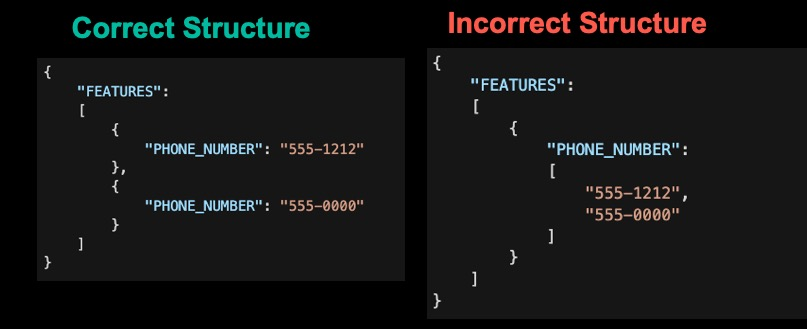

This document defines the Senzing Entity Specification — a detailed guide for mapping source data into Senzing’s entity resolution engine. 

The process of mapping is taking a source field name, like CustomerName, and transforming it into a target field name, by applying specific rules, such as renaming, reformatting, or combining fields based on predefined logic or conditions. It’s like creating a bridge where data from one system is reshaped to fit the structure of another system, guided by those rules.

## Key Terms


Entities, Features and Attributes:

- **Entity** — Records of real-life persons, organizations, or things in your data sources.  These are your customers, your employees, your vendors, your subjects of interest.  
- **Features** — Details that describe an entity, such as a name, a phone number, or an address.
- **Attributes** — Specific components of features. For instance, a name feature might include first and last name. Addresses can have multiple lines, a city, and a state. Even driver’s licenses and passports have a number and an issuing authority.

## What Features to Map

Entity resolution works best when you have a name and one or more of the desired features outlined below.  The more features on each record, the better the entity resolution!

### Desired Features For Persons
- All names including nicknames and aliases.
- Date of birth and gender
- Passport, driver’s license, social security number, national insurance number
- Home and mailing addresses
- Home and cell phone numbers
- Email and social media handles
- Groups that they are associated with, such as their employer name
- Relationships such as:
  - Familial
  - Joint accounts, co-signers
  - Beneficial ownership
  - Principal role in a company

### Desired Features For Organizations
- All names
- Tax ID numbers
- Any ID numbers assigned by governments, agencies, or data providers
- Physical and mailing addresses
- All phone numbers
- Website and social media handles
- Relationships between them such as:
  - Direct and Ultimate parents 
  - Subsidiaries
  - Branches

### Payload Attributes

The use of payload attributes is optional.  In fact, it adds procssessing time and disk storage that strictly speaking isn't necessary for Entity Resolution.  

However, mapping a few key dates, statuses, and categories can help you quickly understand a match.  For instance:
  - If a duplicate customer was found, are they both active?  Which customer record came first? 
  - If you matched a subject record to a watchlist, what type of risk do they carry and where did that data come from?
  - If you matched a customer to a data provider, what did you learn?  What industry are they in?  How long have they been in business?

Think of Senzing as a pointer system to where you can find a person or company in your source systems or data warehouse.  All of the data about them exists there and can be looked up when needed. You wouldn't load it all into Senzing.  In fact, on very large systems, the use of payload attributes is discouraged.

## Examples of Senzing JSON

In prior versions we recommended a flat JSON structure with a separate sublist for each feature that had multiple values.  While we still support that, we now recommend the following JSON structure that has just one list for all features.  It is much cleaner and if you standardize on it, you can write one parser to pull vaues back out of it if needed by downstream processes.

### Recommended JSON Structure

```JSON
{
    "DATA_SOURCE": "CUSTOMERS",
    "RECORD_ID": "1001",
    "FEATURES":
    [
        {
            "RECORD_TYPE": "PERSON"
        },
        {
            "NAME_LAST": "Smith",
            "NAME_FIRST": "Robert",
        },
        {
            "DATE_OF_BIRTH": "12/11/1978"
        },
        {
            "ADDR_TYPE": "HOME",
            "ADDR_LINE1": "123 Main Street",
            "ADDR_CITY": "Las Vegas",
            "ADDR_STATE": "NV",
            "ADDR_POSTAL_CODE": "89132"
        },
        {
            "ADDR_TYPE": "MAILING",
            "ADDR_LINE1": "1515 Adela Lane",
            "ADDR_CITY": "Las Vegas",
            "ADDR_STATE": "NV",
            "ADDR_POSTAL_CODE": "89111"
        },
        {
            "PHONE_TYPE": "MOBILE",
            "PHONE_NUMBER": "702-919-1300"
        },
        {
            "DRIVERS_LICENSE_NUMBER": "112233",
            "DRIVERS_LICENSE_STATE": "NV"
        },
        {
            "EMAIL_ADDRESS": "bsmith@work.com"
        }, 
        {
            "REL_ANCHOR_DOMAIN": "CUSTOMERS",
            "REL_ANCHOR_KEY": "1001"
        },
        {
            "REL_POINTER_DOMAIN": "CUSTOMERS",
            "REL_POINTER_KEY": "1005",
            "REL_POINTER_ROLE": "SON_OF"
        }
    ],
    "CUSTOMER_SINCE": "06/15/2020",
    "STATUS": "Active"
}
```

This structure has:
- **DATA_SOURCE** and **RECORD_ID** at the root level
- One sublist named **FEATURES** that contains all mapped features.
- Any other attribute at the root level must be payload.

**_Important Notes_**
- Because a feature in Senzing *can* have multiple attributes, you cannot supply a JSON list even if there is only one.



### Flat JSON Object

We still support flat json which can be tempting when the source data is flat. Still you may have to deal with multiple values for the same feature.  

```JSON
{
    "DATA_SOURCE": "CUSTOMERS",
    "RECORD_ID": "1001",
    "RECORD_TYPE": "PERSON",
    "NAME_LAST": "Fletcher",
    "NAME_FIRST": "Irwin",
    "NAME_MIDDLE": "Maurice",
    "DATE_OF_BIRTH": "10/08/1943",
    "HOME_ADDR_LINE1": "123 Main Street",
    "HOME_ADDR_CITY": "Las Vegas",
    "HOME_ADDR_STATE": "NV",
    "HOME_ADDR_POSTAL_CODE": "89132",
    "MAILING_ADDR_LINE1": "3 Underhill Way",
    "MAILING_ADDR_LINE2": "#7",
    "MAILING_ADDR_CITY": "Las Vegas",
    "MAILING_ADDR_STATE": "NV",
    "MAILING_ADDR_POSTAL_CODE": "89101",
    "MOBILE_PHONE_NUMBER": "702-919-1300",
    "EMAIL_ADDRESS": "babar@work.com",
    "CUSTOMER_SINCE": "06/15/2020",
    "STATUS": "Active"
}
```
In this case the flat source record likely had a set of fields for a home address and another set for a mailing address.  The address type can be derived from source field's name and used as a prefix for each set of address attributes.  This is necessary because attributes at the same level must be unique.

**_Mapping Guidance_**

- If you have to use a prefix, it must be a single token with no punctuation for the Senzing parser to recognize it.

- The Senzing parser will assign this prefix to the features's usage type field.  In the above case HOME and MAILING will become ADDR_TYPEs.

### Types of data sources

Data sources you will be asked to map to Senzing range from the very simple to the very complex. Here are some of the types we have run into so far and some instructions on how to map them.

- **Source Type 1**: A single flat table that contains one line per entity.  There is usually a unique key, and columns that contain names, addresses, phone numbers, etc.

- **Source Type 2**: A single flat table with multiple rows per entity.  Usually there are only one set of name fields, address fields, etc.  But if an entity has more than one address, it will have multiple rows. Sometimes there is a secondary key that can be used to find all the rows for an entity.  Sometimes you have to derive one from multiple fields. Certain watch lists are like this because they are designed for ease of searching rather than for entity resolution.

- **Source Type 3**: A single seemingly flat table, but the columns might contain lists:  Many XML, JSON or Parquet files are like this. There will only be one row per entity, but the name field(s) may have a list of names, the address field(s) a list of addresses, etc.

- **Source Type 4**: Multiple tables or files per entity.  This is often the case when pulling entities out of a normalized database, but can also occur when you receive a dump of a database in a single JSON or XML source file.

    - You will find there is usually a master table or schema and one or more child tables or schemas, such as a list of addresses, phone numbers, identifiers, relationships, etc.   

    - Sometimes there are even code files that contain a code and a description for things like name types, address types, country ids, etc.  Often these codes are small integers to minimize storage requirements. In this case you will want to look up the id to get the more descriptive value.   For instance, if the country code on the source address record is a number rather than a code.  Look for a codes table that contains the actual country code or name.
 
    - Since Senzing requires one message per entity, you have to join all the master and child tables together. A good approach here is to map each file and join them together for the final step. Spark is a good candidate for this source type.

- **Source Type 5**: Transaction table with embedded entities.  Wire transfers are a good example of this as they reference external accounts with an account number, name and address that aren't well controlled.  Furthermore, there may be thousands with the exact same values.  A good approach here is to extract the identifying fields and dedupe them before sending to Senzing.  You can create a unique key by hashing the identifying fields to use as a RECORD_ID in Senzing and also stamp it on the transaction record itself so that you can join the transaction to its resolved entity in Senzing for analysis.


## General mapping guidance

### Feature Usage Types

There are certain features that source records may have more than one of.  Most notably, these are:

- The NAME feature has a NAME_TYPE attribute for noting if its the primary name, an AKA for a person, a DBA for a company and so on.  Some data providers even provide original script name, low quality aka names, etc. 
- The ADDRESS feature has an ADDR_TYPE attribute for noting if its the  business address, the home, mailing, or any other type of address.  
- The PHONE feature has a PHONE_TYPE attribute for noting if its the home phone, mobile or cell, fax, or any other type of phone.

Senzing always matches features across these types for the following reasons:
1. Some sources don't even specify the type.
2. The home address for one entity might be the mailing address for another.
3. Different sources either have no or different codification standards. 

Most of these types have no meaning for Senzing.  It will be your choice if you choose to map them or not.  Much like payload attributes above, they can be helpful to understand a match, but they do add to processing time.

That being said there are three usage types that do have meaning in Senzing.  They are:

- The NAME_TYPE: "PRIMARY" is used in the calculation to determine the best name to display for the resolved entity. Otherwise, the most common name across all the source records that make up the resolved entity will be selected.  

- The ADDR_TYPE: "BUSINESS" can ***and should be*** assigned to the physical location of an organization.  This adds weight to the address and helps break matches between chains where everything is the same except the address. People often move, companies rarely change physical locations.  

- The PHONE_TYPE: "MOBILE" can be assigned to add weight to the mobile or cell phone.  All the members of a household may report the same home phone.  But people don;t normally share their cell phone number.

**_Mapping Guidance:_**

- Some data sources have fieldnames like NICKNAME, MAILING_ADDR, and HOME_PHONE.  You can derive the type from the source fieldname.  

- Some data sources have a sublist of names, addresses, and/or phone numbers each with their own type field.  Trying to standarize those types across data sources is difficult at best.  

- You can map these as is if you like.  But follow these rules for each feature:
    - For NAME_TYPE, use PRIMARY for the main name when there is more than one.
    - For ADDR_TYPE on organizations only, try to use BUSINESS on at least one of their addresses, even if a type is not specified.
    - For PHONE_TYPE use MOBILE for any of its obvious variations.

### Mapping Identifiers

Some data sources have fields named SSN, DL_NUM, PASSPRT, etc.  This is a simple field name mapping to the appropriate Senzing attribute.

Other data sources, especially data providers, have a sublist of identifiers with an id_type such as: SSN, PP, VAT, EIN, etc.  When the list is small, you can code this with a case statement.  When it is large, you may want to consider a mapping table.

### Updating vs Replacing Records

Senzing always replaces records rather than keep any prior values as history. This is because it is impossible for Senzing to know:
1. Was the prior address corrected or did they move?
2. If there is no phone number on the new record, but there was on the prior, did they tell you to remove it?
3. Are you contractually allowed to keep the prior values?  The answer is no for many data providers and watchlists.

Therefore, all the features of an entity must be presented in a single JSON document including any historical values you wish to keep.  Many source systems already keep such history, so be sure to map those to Senzing as well.  If not, you can keep a simple table with prior record_id and features that you want to keep as history.  

## Dictionary of pre-configured attributes

### Attributes for the record key

These attributes are required to tie records in Senzing back to the source.  They must be placed at the root level in the JSON document.

| Attribute | Type | Required | Example | Notes |
| --- | --- | --- | --- |  --- |
| DATA_SOURCE | String | Required | CUSTOMERS | This is the code for the data source.|
| RECORD_ID | String | Strongly Desired | 1001 | This value must be unique within a data source and is used to determine if Senzing needs to add or replace the record.|

**_Mapping Guidance:_**

- If you do not supply a RECORD_ID, one will be generated based on a hash of the features.  This effectively renders updates impossible since any change to one of its features would generate a new hash.

#### FEATURE: RECORD_TYPE

| Attribute | Type | Required | Example | Notes |
| --- | --- | --- |  --- | --- |
| RECORD_TYPE | String | Strongly Desired | PERSON, ORGANIZATION | Prevents records of different types from resolving.  Leave blank if not known so it can match any type.|

**_Mapping Guidance:_**

- Record type prevents records of different types from resolving together while still allowing them to be related.  You likely wouldn't want Joe Smith and Joe Smith, LLC to resolve even if they are at the same address. 

- Record type is also useful in designating the node shape if you visually render entities and their relationships in a graph!

- Senzing has developed mappers from a number of different data providers and have standardized on the following types:
    - PERSON
    - ORGANIZATION
    - VESSEL
    - AIRCRAFT

### Names of Persons or Organizations

There are three ways to map names:

#### FEATURE: NAME (person)

If the source has the parsed last and first names of a person, map them like this:

| Attribute | Type | Example | Notes |
| --- | --- | --- | --- | 
| NAME_TYPE | String | PRIMARY, AKA | Optional designation when there are multiple.  See [Feature Usage Types](#feature-usage-types)|
| NAME_LAST | String | Smith | This is the last or surname of an individual. |
| NAME_FIRST | String | Robert | This is the first or given name of an individual. |
| NAME_MIDDLE | String | J | This is the middle name of an individual. |
| NAME_PREFIX | String | Mr | This is a prefix for an individual's name such as the titles: Mr, Mrs, Ms, Dr, etc. |
| NAME_SUFFIX | String | MD | This is a suffix for an individual's name and may include generational references such as: JR, SR, I, II, III and/or professional designations such as: MD, PHD, PMP, etc. |

#### FEATURE: NAME (organization)

If the source has a single name field and you know it's an organization name, map it like this:

| Attribute | Type | Example | Notes |
| --- | --- | --- | --- | 
| NAME_TYPE | String | PRIMARY, DBA | Optional designation when there are multiple. See [Feature Usage Types](#feature-usage-types)|
| NAME_ORG | String | Acme Tire Inc. | This is the organization name. |

#### FEATURE: NAME (could be either)

If the source has a single name field and you don't know it's an organization, map it like this:

| Attribute | Type | Example | Notes |
| --- | --- | --- | --- | 
| NAME_TYPE | String | PRIMARY, OTHER | Optional designation when there are multiple. See [Feature Usage Types](#feature-usage-types)|
| NAME_FULL | String | Robert J Smith, Trust | This is either and person or organization name.| 

**_Mapping Guidance:_**

- Sometimes there is both a person name and an organization name on a record, such as a contact list where you have the person and who they work for. In this case you would map the person's name as shown above. But the name of the organization they work for should be mapped as **EMPLOYER_NAME**.  See the section on [Group Associations](#group-associations).

- Sometimes a source system keeps both the parsed version of a person's name as well as the concatenated version on the same record.  The parsed version is preferred because you can get both given and surname scores as well.

### Addresses

There are two ways to map addresses:

#### FEATURE: ADDRESS (parsed)

If the source has parsed address fields, map them like this:

| Attribute | Type | Example | Notes |
| --- | --- | --- | --- | 
| ADDR_TYPE | String | HOME | Optional designation. See [Feature Usage Types](#feature-usage-types)|
| ADDR_LINE1 | String | 111 First St | This is the first line of the address.|
| ADDR_LINE2 | String | Suite 101 | This is the second address line if needed. |
| ADDR_LINE3 | String |  | This is a third address line if needed. |
| ADDR_LINE4 | String |  | This is a fourth address line if needed. |
| ADDR_LINE5 | String |  | This is a fifth address line if needed. |
| ADDR_LINE6 | String |  | This is a sixth address line if needed. |
| ADDR_CITY | String | Las Vegas | This is the city of the address. |
| ADDR_STATE | String | NV | This is the state or province of the address. |
| ADDR_POSTAL_CODE | String | 89111 | This is the zip or postal code of the address. |
| ADDR_COUNTRY | String | US | This is the country of the address. |

#### FEATURE: ADDRESS (single field)

If there is just one address field, map them like this:

| Attribute | Type | Example | Notes |
| --- | --- | --- | --- | 
| ADDR_TYPE | String | HOME | Optional designation.  See [Feature Usage Types](#feature-usage-types)|
| ADDR_FULL | String |  | This is a single string containing all address lines plus city, state, zip and country.|

**_Mapping Guidance:_**

- Sometimes the parsed version of the address include fields like street number, street name, pre-directional, post-directional, but no address line fields.  In this case you need to re-construct the address lines from the parsed fields.

- If both the parsed and the concatenated versions of the address exist on the same source record, you should map the concatenated version as some sources may have only extracted what they could into the parsed fields, potentially losing some meaning.

### Phone numbers

#### FEATURE: PHONE

| Attribute | Type | Example | Notes |
| --- | --- | --- | --- | 
| PHONE_TYPE | String | MOBILE | Optional designation.  See [Feature Usage Types](#feature-usage-types)|
| PHONE_NUMBER | String | 111-11-1111 | This is the actual phone number. |

### Physical and other attributes

#### FEATURE: GENDER

| Attribute | Type | Example | Notes |
| --- | --- | --- | --- | 
| GENDER | String | M | This is the gender such as M for Male and F for Female. |

#### FEATURE: DOB

| Attribute | Type | Example | Notes |
| --- | --- | --- | --- | 
| DATE_OF_BIRTH | String | 1980-05-14 | This is the date of birth for a person. Partial dates such as just month and day or just month and year are acceptable.|

#### FEATURE: DOD

| Attribute | Type | Example | Notes |
| --- | --- | --- | --- | 
| DATE_OF_DEATH | String | 2010-05-14 | This is the date of death for a person. Partial dates are acceptable. |

#### FEATURE: NATIONALITY

| Attribute | Type | Example | Notes |
| --- | --- | --- | --- | 
| NATIONALITY | String | US | This is where the person was born and usually contains a country name or code |

#### FEATURE: CITIZENSHIP

| Attribute | Type | Example | Notes |
| --- | --- | --- | --- | 
| CITIZENSHIP | String | US | This is the country the person is a citizen of and usually contains a country name or code. |

#### FEATURE: POB

| Attribute | Type | Example | Notes |
| --- | --- | --- | --- | 
| PLACE_OF_BIRTH | String | US | This is where the person was born. Ideally it is a country name or code. However, it often contain city names as well. |


#### FEATURE: REGISTRATION_DATE

| Attribute | Type | Example | Notes |
| --- | --- | --- | --- | 
| REGISTRATION_DATE | String | 2010-05-14 | This is the date the organization was registered, like date of birth is to a person. |

#### FEATURE: REGISTRATION_COUNTRY

| Attribute | Type | Example | Notes |
| --- | --- | --- | --- | 
| REGISTRATION_COUNTRY | String | US | This is the country the organization was registered in, like place of birth is to a person. |

### Government-issued identifiers

Government issued IDs help to confirm or deny matches. The following identifiers should be mapped if available.

#### Feature: PASSPORT

| Attribute | Type | Example | Notes |
| --- | --- | --- | --- |
PASSPORT_NUMBER | String | 123456789 | This is the passport number. |
PASSPORT_COUNTRY | String | US | This is the country that issued it. |

#### Feature: DRLIC 

| Attribute | Type | Example | Notes |
| --- | --- | --- | --- |
| DRIVERS_LICENSE_NUMBER | String | 123456789 | This is the driver’s license number. |
| DRIVERS_LICENSE_STATE | String | NV | This is the state, province, or country that issued it. |

#### Feature: SSN 

| Attribute | Type | Example | Notes |
| --- | --- | --- | --- |
| SSN_NUMBER | String | 123-12-1234 | This is the US Social Security number.  Partial SSNs are acceptable.|

#### Feature: NATIONAL_ID 

| Attribute | Type | Example | Notes |
| --- | --- | --- | --- |

| NATIONAL_ID_TYPE | String | CEDULA | Optional: use with caution! see the section on mapping identifiers above.|
| NATIONAL_ID_NUMBER | String | 123121234 | This is the national ID number issued by many countries. It is similar to an SSN in the US. |
| NATIONAL_ID_COUNTRY | String | CA | This is the country that issued it.|

#### Feature: TAX_ID 

| Attribute | Type | Example | Notes |
| --- | --- | --- | --- |
| TAX_ID_TYPE | String | EIN | Optional: use with caution! see the section on mapping identifiers above.|
| TAX_ID_NUMBER | String | 123121234 | This is the actual ID number. |
| TAX_ID_COUNTRY | String | US | This is the country that issued the it.|


#### Feature: OTHER_ID 

| Attribute | Type | Example | Notes |
| --- | --- | --- | --- |
| OTHER_ID_TYPE | String | ISIN | Optional: use with caution! see the section on mapping identifiers above.|
| OTHER_ID_NUMBER | String | 123121234 | This is the actual ID number. |
| OTHER_ID_COUNTRY | String | MX | This is the country that issued it.|

**_Important notes:_**

* Use OTHER_ID sparingly! It is a catch-all for identifiers you don't know much about. It is always better to add a new identifier rather than just putting a lot of different types in this one feature. One reason is you might get cross type false positives!

#### Feature: TRUSTED_ID 

| Attribute | Type | Example | Notes |
| --- | --- | --- | --- |
| TRUSTED_ID_TYPE | String | FORCE_MERGE | The type of ID that is to be trusted. See the note below |
| TRUSTED_ID_NUMBER | String | 123-45-1234 | The trusted unique ID. |

**_Important notes:_**

* Trusted IDs are primarily used to manually force records together or apart as described here … [https://senzing.zendesk.com/hc/en-us/articles/360023523354-How-to-force-records-togetheror-apart](https://senzing.zendesk.com/hc/en-us/articles/360023523354-How-to-force-records-together-or-apart)

### Identifiers issued by organizations

The following identifiers have been added over time and should also be mapped if available.

#### FEATURE: ACCOUNT

| Attribute | Type | Example | Notes |
| --- | --- | --- | --- | 
| ACCOUNT_NUMBER | String | 1234-1234-1234-1234 | This is an account number such as a bank account, credit card number, etc. |
| ACCOUNT_DOMAIN | String | VISA | This is the domain the account number is valid in. |


#### FEATURE: DUNS_NUMBER

| Attribute | Type | Example | Notes |
| --- | --- | --- | --- | 
| DUNS_NUMBER | String | 123123 | The unique identifier for a company.  https://www.dnb.com/duns-number.html |


#### FEATURE: NPI_NUMBER

| Attribute | Type | Example | Notes |
| --- | --- | --- | --- | 
| NPI_NUMBER | String | 123123 | A unique ID for covered health care providers. https://www.cms.gov/Regulations-and-Guidance/Administrative-Simplification/NationalProvIdentStand/ |


#### FEATURE: LEI_NUMBER

| Attribute | Type | Example | Notes |
| --- | --- | --- | --- | 
| LEI_NUMBER | String | 123123 | A unique ID for entities involved in financial transactions. https://en.wikipedia.org/wiki/Legal_Entity_Identifier |

### Websites, email addresses, and other social handles

The following social media attributes are available.

#### FEATURE: WEBSITE

| Attribute | Type | Example | Notes |
| --- | --- | --- | --- | 
| WEBSITE_ADDRESS | String | somecompany.com | This is a website address, usually only present for organization entities. |

#### FEATURE: EMAIL

| Attribute | Type | Example | Notes |
| --- | --- | --- | --- | 
| EMAIL_ADDRESS | String | someone@somewhere.com | This is the actual email address. |

#### FEATURES for Social Media Handles

Social media handles are both a feature and an attribute.

| Feature/Attribute | Type | Example | Notes |
| --- | --- | --- | --- | 
| LINKEDIN | String | xxxxx | This is the unique identifier in this domain. |
| FACEBOOK | String | xxxxx | This is the unique identifier in this domain. |
| TWITTER | String | xxxxx | This is the unique identifier in this domain. |
| SKYPE | String | xxxxx | This is the unique identifier in this domain. |
| ZOOMROOM | String | xxxxx | This is the unique identifier in this domain. |
| INSTAGRAM | String | xxxxx | This is the unique identifier in this domain. |
| WHATSAPP | String | xxxxx | This is the unique identifier in this domain. |
| SIGNAL | String | xxxxx | This is the unique identifier in this domain. |
| TELEGRAM | String | xxxxx | This is the unique identifier in this domain. |
| TANGO | String | xxxxx | This is the unique identifier in this domain. |
| VIBER | String | xxxxx | This is the unique identifier in this domain. |
| WECHAT | String | xxxxx | This is the unique identifier in this domain. |

### Group Associations

Groups a person belongs to can also be useful for resolving entities. Consider two contact lists that only have name and who they work for as useful attributes.

#### FEATURE: EMPLOYER

| Attribute | Type | Example | Notes |
| --- | --- | --- | --- | 
| EMPLOYER | String | ABC Company | This is the name of the organization the person is employed by. |

#### FEATURE: GROUP_ASSOCIATION

| Attribute | Type | Example | Notes |
| --- | --- | --- | --- | 
| GROUP_ASSOCIATION_TYPE | String | MEMBER | This is the type of group an entity belongs to. |
| GROUP_ASSOCIATION_ORG_NAME | String | Group name | This is the name of the organization an entity belongs to. |

#### FEATURE: GROUP_ASSN_ID

| Attribute | Type | Example | Notes |
| --- | --- | --- | --- | 
| GROUP_ASSN_ID_TYPE | String | DUNS | When the group a person is associated with has a registered identifier, place the type of identifier here. |
| GROUP_ASSN_ID_NUMBER | String | 12345 | When the group a person is associated with has a registered identifier, place the identifier here. |

**_Important Notes:_**

*   Group associations should not be confused with disclosed relationships described later in this document. Group associations help resolve entities whereas disclosed relationships help relate them.
*   If all you have in common between two data sources are name and who they work for, a group association can help resolve the Joe Smiths that work at ABC company together.
*   Group associations are subject to generic thresholds to help reduce false positives and keep the system fast. Therefore they will not help resolve _all_ the employees of a large company across data sources. But they could help to resolve the smaller groups of executives,  contacts, or owners of large companies across data sources.

### Disclosed relationships

Some data sources keep track of known relationships between entities. Look for a table within the source system that defines such relationships and include them here.

A relationship can either be unidirectional where one record points to the other or bidirectional where they each point to the other.


This is accomplished by giving a REL_ANCHOR feature to any record that can be related to and a REL_POINTER feature to each record that relates to it.   A record should only ever have one REL_ANCHOR feature, but may have zero or more REL_POINTER features.  For instance, several people may be related to a company so the company only needs one REL_ANCHOR feature they all point to.  But a single person may be related to more than one company so that person can have several REL_POINTER features. 

**_Important notes:_**

- Some sources do not have disclosed relationships so no need to add a REL_ANCHOR to any records, but when they do it is hard to know if a record will be in a relationship and need one.  In this case, you can give one to every company record so that other companies can point to it as a parent or subsidiary as well as people who work for it or own it.   When people may point to each other, every person should get one as well.


#### FEATURE: REL_ANCHOR

| Attribute | Type | Example | Notes |
| --- | --- | --- | --- | 
| REL_ANCHOR_DOMAIN | String | CUSTOMERS | This code helps keep the REL_ANCHOR_KEY unique.  You can just use the DATA_SOURCE code that is providing the relationship here.|
| REL_ANCHOR_KEY | String | 1001 | This key should be a unique value for the record within the REL_ANCHOR_DOMAIN.  You can just use the current record's RECORD_ID here.|


#### FEATURE: REL_POINTER

| Attribute | Type | Example | Notes |
| --- | --- | --- | --- | 
| REL_POINTER_DOMAIN | String | CUSTOMERS | See REL_ANCHOR_DOMAIN above. |
| REL_POINTER_KEY | String | 1001 | See REL_ANCHOR_KEY above.
| REL_POINTER_ROLE | String | SPOUSE | This is the role the pointer record has to the anchor record.  Such as OFFICER_OF, SON_OF, SUBSIDIARY_OF, etc.  It is best to standardize these role codes for display and filtering. |


### Values not used for entity resolution

Sometimes it is desirable to include additional attributes that can help determine the importance of a resolution or relationship. These attributes are not used for entity resolution because they are not configured in Senzing. These attributes may include values such as key dates, statuses, types, and categories.  

For example:

* The customer since date and status flag of a customer
* The hire date and job title of an employee.  The termination date and reason if terminated.
* The entry date and risk reason of a watchlist record.


## Special Feature Types and Labels


Some features have special labels that add weight to them. For instance, you might find a whole family at a “home” address, but only one company (or company facility) at its physical “business” address. The following special labels can be used to augment a feature’s weight …

| Feature | Label | Notes | When to use |
| --- | --- | --- | --- | 
| PRIMARY | People can have AKAs and nicknames; companies can have DBAs. When the system resolves multiple records into an entity, a PRIMARY name will be chosen over any other type. | Usage: When a source provides multiple names on a record |
| BUSINESS | Companies with multiple facilities or outlets often share corporate phone numbers and website addresses. Use this label to help break matches based on their physical location. | Usage: To prevent overmatching of companies. |
| PHONE | MOBILE | Home and work phone numbers are often shared. Use this label to add weight to mobile or “cell” phones as they are shared far less often. | Usage: Only apply if data source reliably uses mobile phones to distinguish entities. |

## Additional configuration

Senzing comes pre-configured with all the features, attributes, and settings you will likely need to begin resolving persons and organizations immediately. The only configuration that really needs to be added is what you named your data sources.

Email support@senzing.com for assistance with custom attributes.

## How to add a data source

On your Senzing project's bin directory is an application called sz_configtool.

Adding a new data source is as simple as registering the code you want to use for it. Most of the reporting you will want to do is based on matches within or across data sources.

* If you want to know when a customer record matches a watchlist record, you should have a data source named `CUSTOMERS` and another named `WATCHLIST`.
* If you are matching two customer data sources to find the overlap, you could have one data source named `SOURCE1-CUSTOMERS` and another named `SOURCE2-CUSTOMERS` substituting SOURCE1 and SOURCE2 with something more meaningful. 

For example, to add a new data source named `CUSTOMERS` using `G2ConfigTool.py`:

```console
./G2ConfigTool.py

Welcome to the Senzing configuration tool! Type help or ? to list commands

(g2cfg) addDataSource CUSTOMERS

Data source successfully added!

(g2cfg) save

Are you certain you wish to proceed and save changes? (y/n) y

Configuration changes saved!
```